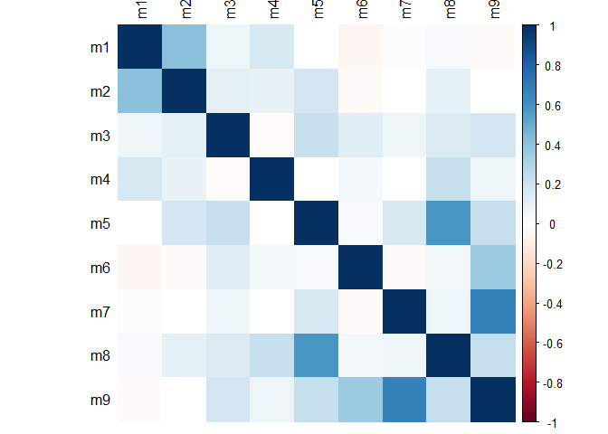
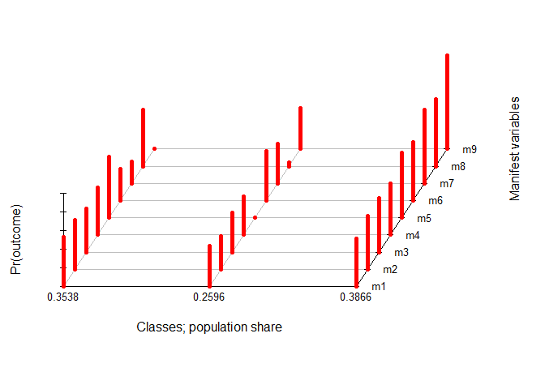
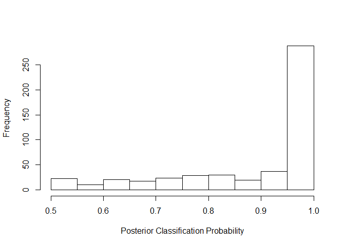
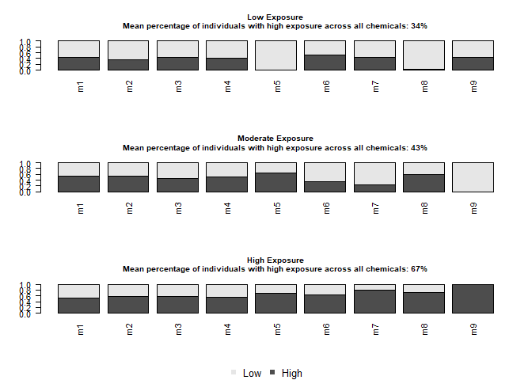

Latent class analysis applied to a simulated chemical mixtures example
================
Rachel Carroll

Utilized R packages: poLCA, corrplot, formattable

This R markdown file furnishes a simulated data example using the R package poLCA for performing latent class analysis (LCA) in the area of chemical mixtures modeling, though much of this code would be workable in other scenarios as well. This example is referred to in a paper entitled "Latent classes for chemical mixtures analyses in epidemiology: An example using phthlate and phenol exposure biomarkers in pregnant women" by Carroll R. et. al. which is currently under revision. Please refer to that publication for more information about LCA in environmental epidemiology, and please refer to statistical text, such as "Categorical Data Analysis" by A. Agresti, for statistical details about LCA. The rest of this file is organized into chunks of text preceeding the code chunks that it describes.

The first chunk of R code is for reading in the simulated data; this data is available in the LCAmix repo so that you can also run the example on your own. The data includes 3 covariates (x1 (binary), x2 (continuous), and x3 (continuous)), nine moderately correlated chemical measures (m1-m9), and a continuous outcome (y).

``` r
ExData=read.csv("ExData.csv")
attach(ExData)
n=dim(ExData)[1]
```

As our first step of analysis, we will examine the correlation matrix of the chemicals. This is done with the base cor() function along with the formattable() function as well as with the corrplot package in R. From these results, we can see that there exists little to moderate correlation in the chemicals presented here with −0.04 &lt; *ρ* &lt; 0.67. The chemical pairs with the highest amount of correlation include *ρ*<sub>*m*6, *m*9</sub> = 0.36, *ρ*<sub>*m*1, *m*2</sub> = 0.41, *ρ*<sub>*m*5, *m*8</sub> = 0.58, and *ρ*<sub>*m*7, *m*9</sub> = 0.67.

``` r
cor_bold <- formatter("span", 
  style = x ~ style("font-weight" = ifelse(abs(x) >= .3 | is.character(x), 
                                           "bold", NA)))
formattable(as.data.frame(round(cor(ExData[,5:13]),2)),
            list(m1=cor_bold,m2=cor_bold,m2=cor_bold,m3=cor_bold,m4=cor_bold,m5=cor_bold,m6=cor_bold,m7=cor_bold,m8=cor_bold,m9=cor_bold))
```

<table class="table table-condensed">
<thead>
<tr>
<th style="text-align:left;">
</th>
<th style="text-align:right;">
m1
</th>
<th style="text-align:right;">
m2
</th>
<th style="text-align:right;">
m3
</th>
<th style="text-align:right;">
m4
</th>
<th style="text-align:right;">
m5
</th>
<th style="text-align:right;">
m6
</th>
<th style="text-align:right;">
m7
</th>
<th style="text-align:right;">
m8
</th>
<th style="text-align:right;">
m9
</th>
</tr>
</thead>
<tbody>
<tr>
<td style="text-align:left;">
m1
</td>
<td style="text-align:right;">
<span style="font-weight: bold">1.00</span>
</td>
<td style="text-align:right;">
<span style="font-weight: bold">0.41</span>
</td>
<td style="text-align:right;">
<span>0.07</span>
</td>
<td style="text-align:right;">
<span>0.18</span>
</td>
<td style="text-align:right;">
<span>0.00</span>
</td>
<td style="text-align:right;">
<span>-0.04</span>
</td>
<td style="text-align:right;">
<span>0.01</span>
</td>
<td style="text-align:right;">
<span>0.03</span>
</td>
<td style="text-align:right;">
<span>-0.03</span>
</td>
</tr>
<tr>
<td style="text-align:left;">
m2
</td>
<td style="text-align:right;">
<span style="font-weight: bold">0.41</span>
</td>
<td style="text-align:right;">
<span style="font-weight: bold">1.00</span>
</td>
<td style="text-align:right;">
<span>0.11</span>
</td>
<td style="text-align:right;">
<span>0.10</span>
</td>
<td style="text-align:right;">
<span>0.19</span>
</td>
<td style="text-align:right;">
<span>-0.02</span>
</td>
<td style="text-align:right;">
<span>0.00</span>
</td>
<td style="text-align:right;">
<span>0.11</span>
</td>
<td style="text-align:right;">
<span>-0.01</span>
</td>
</tr>
<tr>
<td style="text-align:left;">
m3
</td>
<td style="text-align:right;">
<span>0.07</span>
</td>
<td style="text-align:right;">
<span>0.11</span>
</td>
<td style="text-align:right;">
<span style="font-weight: bold">1.00</span>
</td>
<td style="text-align:right;">
<span>-0.01</span>
</td>
<td style="text-align:right;">
<span>0.22</span>
</td>
<td style="text-align:right;">
<span>0.14</span>
</td>
<td style="text-align:right;">
<span>0.08</span>
</td>
<td style="text-align:right;">
<span>0.16</span>
</td>
<td style="text-align:right;">
<span>0.18</span>
</td>
</tr>
<tr>
<td style="text-align:left;">
m4
</td>
<td style="text-align:right;">
<span>0.18</span>
</td>
<td style="text-align:right;">
<span>0.10</span>
</td>
<td style="text-align:right;">
<span>-0.01</span>
</td>
<td style="text-align:right;">
<span style="font-weight: bold">1.00</span>
</td>
<td style="text-align:right;">
<span>0.00</span>
</td>
<td style="text-align:right;">
<span>0.04</span>
</td>
<td style="text-align:right;">
<span>0.01</span>
</td>
<td style="text-align:right;">
<span>0.23</span>
</td>
<td style="text-align:right;">
<span>0.07</span>
</td>
</tr>
<tr>
<td style="text-align:left;">
m5
</td>
<td style="text-align:right;">
<span>0.00</span>
</td>
<td style="text-align:right;">
<span>0.19</span>
</td>
<td style="text-align:right;">
<span>0.22</span>
</td>
<td style="text-align:right;">
<span>0.00</span>
</td>
<td style="text-align:right;">
<span style="font-weight: bold">1.00</span>
</td>
<td style="text-align:right;">
<span>0.03</span>
</td>
<td style="text-align:right;">
<span>0.18</span>
</td>
<td style="text-align:right;">
<span style="font-weight: bold">0.58</span>
</td>
<td style="text-align:right;">
<span>0.23</span>
</td>
</tr>
<tr>
<td style="text-align:left;">
m6
</td>
<td style="text-align:right;">
<span>-0.04</span>
</td>
<td style="text-align:right;">
<span>-0.02</span>
</td>
<td style="text-align:right;">
<span>0.14</span>
</td>
<td style="text-align:right;">
<span>0.04</span>
</td>
<td style="text-align:right;">
<span>0.03</span>
</td>
<td style="text-align:right;">
<span style="font-weight: bold">1.00</span>
</td>
<td style="text-align:right;">
<span>-0.03</span>
</td>
<td style="text-align:right;">
<span>0.05</span>
</td>
<td style="text-align:right;">
<span style="font-weight: bold">0.36</span>
</td>
</tr>
<tr>
<td style="text-align:left;">
m7
</td>
<td style="text-align:right;">
<span>0.01</span>
</td>
<td style="text-align:right;">
<span>0.00</span>
</td>
<td style="text-align:right;">
<span>0.08</span>
</td>
<td style="text-align:right;">
<span>0.01</span>
</td>
<td style="text-align:right;">
<span>0.18</span>
</td>
<td style="text-align:right;">
<span>-0.03</span>
</td>
<td style="text-align:right;">
<span style="font-weight: bold">1.00</span>
</td>
<td style="text-align:right;">
<span>0.06</span>
</td>
<td style="text-align:right;">
<span style="font-weight: bold">0.67</span>
</td>
</tr>
<tr>
<td style="text-align:left;">
m8
</td>
<td style="text-align:right;">
<span>0.03</span>
</td>
<td style="text-align:right;">
<span>0.11</span>
</td>
<td style="text-align:right;">
<span>0.16</span>
</td>
<td style="text-align:right;">
<span>0.23</span>
</td>
<td style="text-align:right;">
<span style="font-weight: bold">0.58</span>
</td>
<td style="text-align:right;">
<span>0.05</span>
</td>
<td style="text-align:right;">
<span>0.06</span>
</td>
<td style="text-align:right;">
<span style="font-weight: bold">1.00</span>
</td>
<td style="text-align:right;">
<span>0.24</span>
</td>
</tr>
<tr>
<td style="text-align:left;">
m9
</td>
<td style="text-align:right;">
<span>-0.03</span>
</td>
<td style="text-align:right;">
<span>-0.01</span>
</td>
<td style="text-align:right;">
<span>0.18</span>
</td>
<td style="text-align:right;">
<span>0.07</span>
</td>
<td style="text-align:right;">
<span>0.23</span>
</td>
<td style="text-align:right;">
<span style="font-weight: bold">0.36</span>
</td>
<td style="text-align:right;">
<span style="font-weight: bold">0.67</span>
</td>
<td style="text-align:right;">
<span>0.24</span>
</td>
<td style="text-align:right;">
<span style="font-weight: bold">1.00</span>
</td>
</tr>
</tbody>
</table>
``` r
corrplot(cor(ExData[,5:13]),method="color",tl.col="black")
```



Now we will perform the LCA. The first step of this involves dichotomizing the chemicals such that 1 indicates a below the median measure of the chemical and 2 indictes an above the median measure of the chemical. Note: You will get an error if you dichotomize as 0/1.

``` r
catchems=ExData[,5:13]
for (i in 1:9){
  catchems[,i]=ifelse(ExData[,4+i]<median(ExData[,4+i]),1,2)
}
```

The next step of the LCA procedure requires selecting the appropriate number of classes. The poLCA function can estimate several goodness of fit measures (log likelihood, AIC, BIC, *G*<sup>2</sup>, and *χ*<sup>2</sup>) for this purpose. The next chunk of code performs the LCA for class sizes 2-10 using a for loop and stores the goodness of fit measures to a matrix object named gof. Some description of the code follows.

The object f is the input formula required by the poLCA function. This formula column binds the 9 chemicals (m1-m9) to the left of the ~ to indicate that these are the manifest variables for the LCA. The 1 to the right of the ~ means that we are not adjusting for any covariates in this implementation of LCA. Covariate adjusted LCA could be implemented by replacing the 1 with x1+x2 (or similar).

A seed must be set here to guarentee that the same results are produced each time you run the example. Results for poLCA (and most LCA software) differ because the method requires the use of an algorithm that involves some randomness. poLCA uses the EM algorithm for this purpose.

For all of the goodness of fit measures, a smaller magnitude indicates a better fitting model. Using the formattable package, we can create a table that nicely displays the estimates. The table is formatted such that the best and competing models are indicated with bold text. However, it appears that the bold text formatting is not visable on GitHub. These goodness of fit results suggest that the three class model will be the best. Similarly to the results in the paper, this number of classes was indicated as best for one of the criterion (BIC), and we believe that it would be the most interpretable. In the case of AIC, three different class sizes are considered comparable since they are within 4 units of each other. However, if this was the criterion we decided to use, the five class model would be superior since it uses less parameters to acheive a comparable AIC measure.

``` r
f<-cbind(m1,m2,m3,m4,m5,m6,m7,m8,m9)~1
gof=matrix(1,9,6)
colnames(gof)<-c("k=","llik","AIC","BIC","Gsq","Chisq")
for (i in 2:10){
  set.seed(05162018)
  res=poLCA(f,as.data.frame(catchems),graphs = F,nclass=i,verbose=F)
  gof[i-1,]=c(i,res$llik,res$aic,res$bic,res$Gsq,res$Chisq)
}
min_bold <- formatter("span", 
  style = x ~ style("font-weight" = ifelse(abs(x) == min(abs(x)) | abs(abs(x) - min(abs(x)))<=4, 
                                           "bold", NA)))
formattable(as.data.frame(gof),
            list(llik=min_bold,AIC=min_bold,BIC=min_bold,Gsq=min_bold,Chisq=min_bold))
```

<table class="table table-condensed">
<thead>
<tr>
<th style="text-align:right;">
k=
</th>
<th style="text-align:right;">
llik
</th>
<th style="text-align:right;">
AIC
</th>
<th style="text-align:right;">
BIC
</th>
<th style="text-align:right;">
Gsq
</th>
<th style="text-align:right;">
Chisq
</th>
</tr>
</thead>
<tbody>
<tr>
<td style="text-align:right;">
2
</td>
<td style="text-align:right;">
<span>-3056.222</span>
</td>
<td style="text-align:right;">
<span>6150.444</span>
</td>
<td style="text-align:right;">
<span>6230.521</span>
</td>
<td style="text-align:right;">
<span>691.8357</span>
</td>
<td style="text-align:right;">
<span>653.1399</span>
</td>
</tr>
<tr>
<td style="text-align:right;">
3
</td>
<td style="text-align:right;">
<span>-2993.575</span>
</td>
<td style="text-align:right;">
<span>6045.151</span>
</td>
<td style="text-align:right;">
<span style="font-weight: bold">6167.375</span>
</td>
<td style="text-align:right;">
<span>566.5428</span>
</td>
<td style="text-align:right;">
<span>525.1544</span>
</td>
</tr>
<tr>
<td style="text-align:right;">
4
</td>
<td style="text-align:right;">
<span>-2975.696</span>
</td>
<td style="text-align:right;">
<span>6029.393</span>
</td>
<td style="text-align:right;">
<span>6193.763</span>
</td>
<td style="text-align:right;">
<span>530.7848</span>
</td>
<td style="text-align:right;">
<span>492.4118</span>
</td>
</tr>
<tr>
<td style="text-align:right;">
5
</td>
<td style="text-align:right;">
<span>-2955.636</span>
</td>
<td style="text-align:right;">
<span style="font-weight: bold">6009.272</span>
</td>
<td style="text-align:right;">
<span>6215.788</span>
</td>
<td style="text-align:right;">
<span>490.6639</span>
</td>
<td style="text-align:right;">
<span>471.0540</span>
</td>
</tr>
<tr>
<td style="text-align:right;">
6
</td>
<td style="text-align:right;">
<span>-2944.972</span>
</td>
<td style="text-align:right;">
<span style="font-weight: bold">6007.944</span>
</td>
<td style="text-align:right;">
<span>6256.606</span>
</td>
<td style="text-align:right;">
<span>469.3363</span>
</td>
<td style="text-align:right;">
<span>428.0291</span>
</td>
</tr>
<tr>
<td style="text-align:right;">
7
</td>
<td style="text-align:right;">
<span>-2937.187</span>
</td>
<td style="text-align:right;">
<span>6012.373</span>
</td>
<td style="text-align:right;">
<span>6303.181</span>
</td>
<td style="text-align:right;">
<span>453.7652</span>
</td>
<td style="text-align:right;">
<span>423.0784</span>
</td>
</tr>
<tr>
<td style="text-align:right;">
8
</td>
<td style="text-align:right;">
<span>-2926.929</span>
</td>
<td style="text-align:right;">
<span style="font-weight: bold">6011.858</span>
</td>
<td style="text-align:right;">
<span>6344.812</span>
</td>
<td style="text-align:right;">
<span>433.2498</span>
</td>
<td style="text-align:right;">
<span>401.2228</span>
</td>
</tr>
<tr>
<td style="text-align:right;">
9
</td>
<td style="text-align:right;">
<span>-2922.029</span>
</td>
<td style="text-align:right;">
<span>6022.058</span>
</td>
<td style="text-align:right;">
<span>6397.158</span>
</td>
<td style="text-align:right;">
<span>423.4499</span>
</td>
<td style="text-align:right;">
<span>379.5120</span>
</td>
</tr>
<tr>
<td style="text-align:right;">
10
</td>
<td style="text-align:right;">
<span style="font-weight: bold">-2912.658</span>
</td>
<td style="text-align:right;">
<span>6023.315</span>
</td>
<td style="text-align:right;">
<span>6440.562</span>
</td>
<td style="text-align:right;">
<span style="font-weight: bold">404.7073</span>
</td>
<td style="text-align:right;">
<span style="font-weight: bold">375.4800</span>
</td>
</tr>
</tbody>
</table>
Now that we've determined the ideal number of classes (3), we can perform the LCA for that particular model and use the results. The results displayed in this chuck are the default output from the poLCA fucntion.

From the output printed to the console, we see the proportions of below the median vs. above the median measures for all nine chemical to each of the three classes, the proportion of the population per class (*π*<sub>*k*</sub> from the manuscript), and the goodness of fit measures.

The plot produced from this code displays the proportion of above the median measures for each class (classes 1-3 left to right) and chemical (*p*<sub>*k*, *m*</sub> from the manuscript, the Pr(2) column from the console output). In my opinion, this is not the best way to display these results, so we will create an alternative display later.

The final line of code in this chunk creates a vector object, assignLCA3, with the class assignments for the 500 individuals in the dataset. This vector can be used for secondary assessments of the latent classes.

``` r
set.seed(05162018)
res=poLCA(f,as.data.frame(catchems),graphs = T,nclass=3)
```



    ## Conditional item response (column) probabilities,
    ##  by outcome variable, for each class (row) 
    ##  
    ## $m1
    ##            Pr(1)  Pr(2)
    ## class 1:  0.4684 0.5316
    ## class 2:  0.5637 0.4363
    ## class 3:  0.4862 0.5138
    ## 
    ## $m2
    ##            Pr(1)  Pr(2)
    ## class 1:  0.4734 0.5266
    ## class 2:  0.6430 0.3570
    ## class 3:  0.4283 0.5717
    ## 
    ## $m3
    ##            Pr(1)  Pr(2)
    ## class 1:  0.5321 0.4679
    ## class 2:  0.5739 0.4261
    ## class 3:  0.4210 0.5790
    ## 
    ## $m4
    ##            Pr(1)  Pr(2)
    ## class 1:  0.4907 0.5093
    ## class 2:  0.5910 0.4090
    ## class 3:  0.4475 0.5525
    ## 
    ## $m5
    ##            Pr(1)  Pr(2)
    ## class 1:  0.3500 0.6500
    ## class 2:  1.0000 0.0000
    ## class 3:  0.3016 0.6984
    ## 
    ## $m6
    ##            Pr(1)  Pr(2)
    ## class 1:  0.6573 0.3427
    ## class 2:  0.4714 0.5286
    ## class 3:  0.3753 0.6247
    ## 
    ## $m7
    ##            Pr(1)  Pr(2)
    ## class 1:  0.7653 0.2347
    ## class 2:  0.5720 0.4280
    ## class 3:  0.2088 0.7912
    ## 
    ## $m8
    ##            Pr(1)  Pr(2)
    ## class 1:  0.3983 0.6017
    ## class 2:  0.9600 0.0400
    ## class 3:  0.2843 0.7157
    ## 
    ## $m9
    ##            Pr(1)  Pr(2)
    ## class 1:  1.0000 0.0000
    ## class 2:  0.5631 0.4369
    ## class 3:  0.0000 1.0000
    ## 
    ## Estimated class population shares 
    ##  0.3538 0.2596 0.3866 
    ##  
    ## Predicted class memberships (by modal posterior prob.) 
    ##  0.31 0.324 0.366 
    ##  
    ## ========================================================= 
    ## Fit for 3 latent classes: 
    ## ========================================================= 
    ## number of observations: 500 
    ## number of estimated parameters: 29 
    ## residual degrees of freedom: 471 
    ## maximum log-likelihood: -2993.575 
    ##  
    ## AIC(3): 6045.151
    ## BIC(3): 6167.375
    ## G^2(3): 566.5428 (Likelihood ratio/deviance statistic) 
    ## X^2(3): 525.1544 (Chi-square goodness of fit) 
    ## 

``` r
assignLCA3=res$predclass
```

Another important part of the LCA procedure involves calculating the posterior probabilities. These probabilities give an indication of how sure we are about an individual's class assignment, and the next chunk of code demostrates how this information is extracted from the poLCA object. Essentially, this code takes the posterior probability matrix that is available from the poLCA object and extracts the probabilty associated with the class that the individual was assigned to. The summary measures and histogram of the resulting vector suggest that the posterior class membership probabilities were high (median 99.5%, interquartile range: 80.0%, 100.0%) indicating that individuals have a high probability of belonging to the class to which they were assigned.

``` r
postprobsMat=round(res$posterior,3)
postprobsVec=rep(0,n)
for (i in 1:n){postprobsVec[i]=postprobsMat[i,assignLCA3[i]]}
round(summary(postprobsVec),2)
```

    ##    Min. 1st Qu.  Median    Mean 3rd Qu.    Max. 
    ##    0.51    0.80    0.99    0.89    1.00    1.00

``` r
hist(postprobsVec,main="",xlab="Posterior Classification Probability")
```

 As mentioned previously, the default plot from poLCA is not as ideal display. The next code chunk creates an improved, alternate display of class distribution across the chemicals. The main improvements that this plot offers are 1) sorting the classes in order of mean above the median exposure (these values are also calculated in the code below) and 2) presenting the below the median proportion in addition to the above the median proportion for each class/chemical combination. From this display, we can see that the classes seem to be separating individuals with "low", "moderate", and "high" exposure.

``` r
data1=rbind(res$probs$m1[1,],res$probs$m2[1,],res$probs$m3[1,],
            res$probs$m4[1,],res$probs$m5[1,],res$probs$m6[1,],
            res$probs$m7[1,],res$probs$m8[1,],res$probs$m9[1,])
data2=rbind(res$probs$m1[2,],res$probs$m2[2,],res$probs$m3[2,],
            res$probs$m4[2,],res$probs$m5[2,],res$probs$m6[2,],
            res$probs$m7[2,],res$probs$m8[2,],res$probs$m9[2,])
data3=rbind(res$probs$m1[3,],res$probs$m2[3,],res$probs$m3[3,],
            res$probs$m4[3,],res$probs$m5[3,],res$probs$m6[3,],
            res$probs$m7[3,],res$probs$m8[3,],res$probs$m9[3,])
mean(data2[,2])
```

    ## [1] 0.3402165

``` r
mean(data1[,2])
```

    ## [1] 0.4293978

``` r
mean(data3[,2])
```

    ## [1] 0.6718969

``` r
layout(matrix(1:4,nrow=4,ncol=1),heights=c(rep(.32,3),.04))
barplot(t(data2[,c(2,1)]),col=grey.colors(2),main="Low Exposure\nMean percentage of individuals with high exposure across all chemicals: 34%",cex.main=.9,
        names=colnames(catchems),las=2)
barplot(t(data1[,c(2,1)]),col=grey.colors(2),main="Moderate Exposure\nMean percentage of individuals with high exposure across all chemicals: 43%",cex.main=.9,
        names=colnames(catchems),las=2)
barplot(t(data3[,c(2,1)]),col=grey.colors(2),main="High Exposure\nMean percentage of individuals with high exposure across all chemicals: 67%",cex.main=.9,
        names=colnames(catchems),las=2)
par(mar=rep(0,4))
plot(NULL ,xaxt='n',yaxt='n',bty='n',ylab='',xlab='', xlim=0:1, ylim=0:1)
legend("center",c("Low","High"),pch=15,col=grey.colors(2)[c(2,1)],horiz = TRUE,cex=1.25,bty = "n")
```

 It may also be of interest to determine association between the LC's and covariates of interest. This can be accomplished with Chi square test for categorical variables and t tests for continuous variables. The t tests could be performed testing and comparing each level of the LC's. However, I've only tested for the "low" vs. "high" exposure classes here. The first line of code in this chunk reorders the LC assignment based on the ordering of the plot above. From the Chi square and t tests, we see that there is no association between the LC's and the covariates of interest.

``` r
reassignLCA3=ifelse(assignLCA3==2,1,ifelse(assignLCA3==1,2,3))

tbl=table(x1,assignLCA3)
tbl
```

    ##    assignLCA3
    ## x1    1   2   3
    ##   0  46  43  39
    ##   1 109 119 144

``` r
chisq.test(tbl)
```

    ## 
    ##  Pearson's Chi-squared test
    ## 
    ## data:  tbl
    ## X-squared = 3.1957, df = 2, p-value = 0.2023

``` r
t.test(x2[which(reassignLCA3==1)],x2[which(reassignLCA3==3)])
```

    ## 
    ##  Welch Two Sample t-test
    ## 
    ## data:  x2[which(reassignLCA3 == 1)] and x2[which(reassignLCA3 == 3)]
    ## t = -1.4605, df = 341.15, p-value = 0.1451
    ## alternative hypothesis: true difference in means is not equal to 0
    ## 95 percent confidence interval:
    ##  -0.38140669  0.05635716
    ## sample estimates:
    ##   mean of x   mean of y 
    ## -0.21776292 -0.05523815

``` r
t.test(x3[which(reassignLCA3==1)],x3[which(reassignLCA3==3)])
```

    ## 
    ##  Welch Two Sample t-test
    ## 
    ## data:  x3[which(reassignLCA3 == 1)] and x3[which(reassignLCA3 == 3)]
    ## t = 0.92319, df = 340, p-value = 0.3566
    ## alternative hypothesis: true difference in means is not equal to 0
    ## 95 percent confidence interval:
    ##  -0.1205221  0.3337183
    ## sample estimates:
    ##    mean of x    mean of y 
    ## -0.002100103 -0.108698218

There may also be an outcome of interest that we wish to examine with the assigned LC's, and the last code chunk accomplishes that for our simulated continuous outcome by using the lm() function in R. Contrasts could also be evaluated by rotating the reference group for the LC's, but the low exposure group is the reference group for this after the reordering that occurred above. From these results, we see that both the covariates and the LC's are significantly related to the outcome of interest. Specifically for the LC's, we can state that those in the high exposure group have signficantly elevated levels of the outcome compared to the low exposure group. Alternatively, those in the moderate exposure group have singificantly attenuated levels of the outcome of interest compared to the low exposure group.

``` r
mod=lm(y~x1+x2+x3+factor(reassignLCA3))
summary(mod)
```

    ## 
    ## Call:
    ## lm(formula = y ~ x1 + x2 + x3 + factor(reassignLCA3))
    ## 
    ## Residuals:
    ##      Min       1Q   Median       3Q      Max 
    ## -1.33378 -0.37047 -0.01161  0.35328  1.53398 
    ## 
    ## Coefficients:
    ##                       Estimate Std. Error t value Pr(>|t|)    
    ## (Intercept)            0.95368    0.05346  17.839   <2e-16 ***
    ## x1                    -0.96154    0.05052 -19.034   <2e-16 ***
    ## x2                     0.89537    0.02146  41.728   <2e-16 ***
    ## x3                    -0.50696    0.02117 -23.943   <2e-16 ***
    ## factor(reassignLCA3)2 -0.12485    0.05535  -2.255   0.0245 *  
    ## factor(reassignLCA3)3  0.83327    0.05312  15.688   <2e-16 ***
    ## ---
    ## Signif. codes:  0 '***' 0.001 '**' 0.01 '*' 0.05 '.' 0.1 ' ' 1
    ## 
    ## Residual standard error: 0.4902 on 494 degrees of freedom
    ## Multiple R-squared:  0.8696, Adjusted R-squared:  0.8683 
    ## F-statistic: 659.2 on 5 and 494 DF,  p-value: < 2.2e-16

With this example, you should be ready to perform LCA in the chemical mixtures and other settings! Please feel free to contact me at <carrollr@uncw.edu> with any suggestions or questions. Also, check out my other repos and personal [website](https://www.rachelmcarroll.weebly.com) for other research projects in the areas of biostatistical methods and application to oncology, spatial and temporal data, environmental data, and public health.
